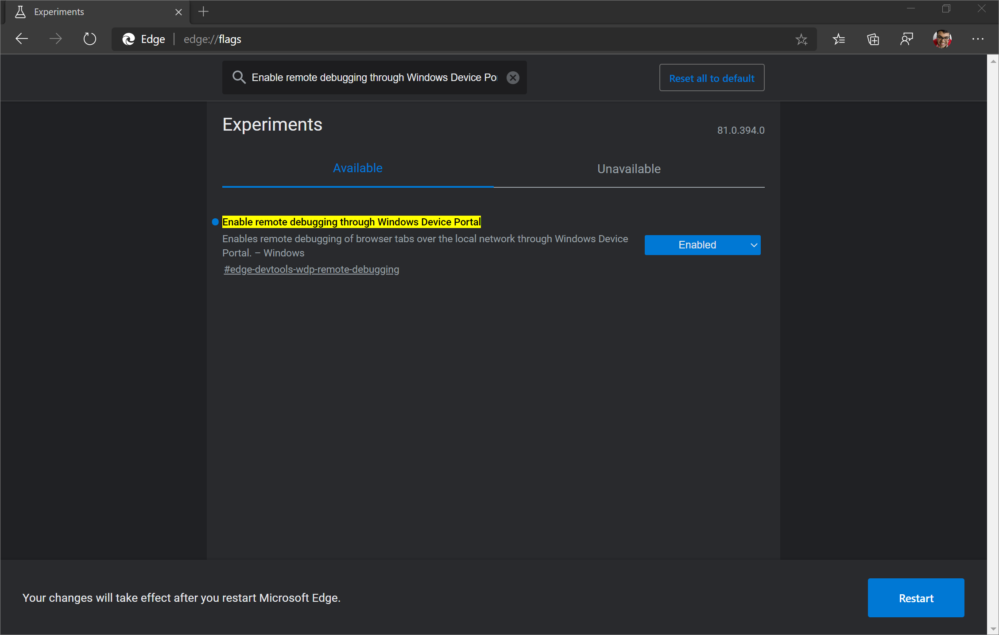
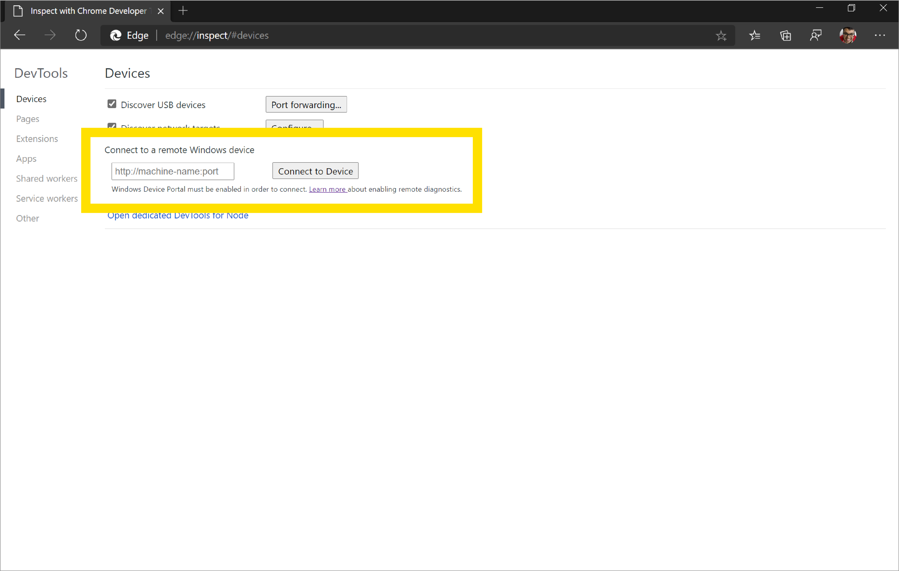
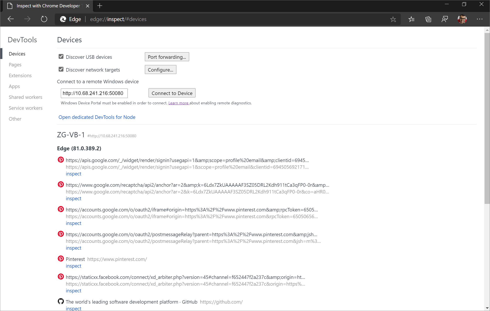
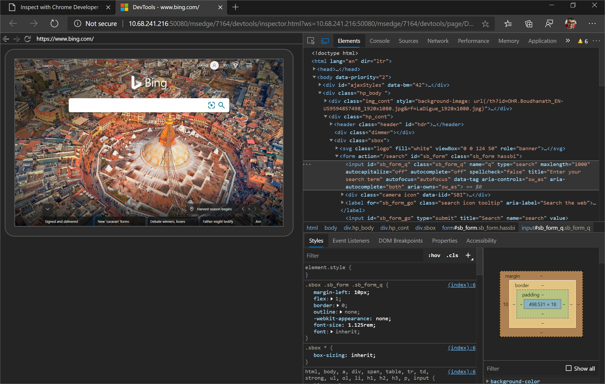

# Erste Schritte mit dem Remote Debuggen von Windows 10-Geräten  

Remote Debuggen von Liveinhalten auf einem Windows 10-Gerät von Ihrem Windows-oder macOS-Computer aus.  In diesem Lernprogramm lernen Sie, wie Sie:  

*   Richten Sie Ihr Windows 10-Gerät für das Remotedebuggen ein, und stellen Sie von Ihrem Entwicklungscomputer aus eine Verbindung her.  
*   Überprüfen und Debuggen Sie Liveinhalte auf Ihrem Windows 10-Gerät von Ihrem Entwicklungscomputer.  
*   Screencast-Inhalte von Ihrem Windows 10-Gerät auf eine devtools-Instanz auf Ihrem Entwicklungscomputer.  

## Schritt 1: Einrichten des Hosts (zu debuggender Computer)  

Der Host-oder zu debuggende Computer ist das Windows 10-Gerät, das gedebuggt werden soll.  Es kann sich um ein Remotegerät handeln, das für Sie schwer physisch zugänglich ist, oder es ist möglicherweise nicht mit Tastatur-und Maus Peripheriegeräten ausgestattet, wodurch es schwierig ist, mit dem Microsoft Edge-devtools auf diesem Gerät zu interagieren.  Zum Einrichten des Hostcomputers (zu debuggende Komponente) müssen Sie Folgendes ausführen:  

*   Installieren und Konfigurieren von [Microsoft Edge (Chrom)](https://www.microsoft.com/edge)  
*   Installieren der [Remote Tools für Microsoft Edge (Beta)](https://www.microsoft.com/store/apps/9P6CMFV44ZLT) aus dem [Microsoft Store](https://www.microsoft.com/store/apps/windows)  
*   Aktivieren des [Entwicklermodus](https://docs.microsoft.com/windows/uwp/get-started/enable-your-device-for-development) und Aktivieren des [Geräte Portals](https://docs.microsoft.com/windows/uwp/debug-test-perf/device-portal)  

### Installieren und Konfigurieren von Microsoft Edge (Chrom)  

Wenn Sie dies noch nicht getan haben, installieren Sie Microsoft Edge (Chrom) auf [dieser Seite](https://www.microsoft.com/edge).  Wenn Sie eine vorinstallierte Version von Microsoft Edge auf dem Hostcomputer verwenden, überprüfen Sie, ob Microsoft Edge (Chrom) und nicht Microsoft Edge (EdgeHTML) installiert ist.  Eine schnelle Möglichkeit zur Überprüfung besteht darin, `edge://settings/help` im Browser zu laden und zu bestätigen, dass die Versionsnummer 75 oder höher ist.  

Navigieren Sie nun zu `edge://flags` in Microsoft Edge (Chrom).  Geben Sie in **Such Kennzeichnungen**unter **Aktivieren des Remotedebuggens über das Windows Device Portal**ein.  Setzen Sie dieses Flag auf **Enabled**.  Klicken Sie dann auf die Schaltfläche **Neustart** , um Microsoft Edge (Chrom) neu zu starten.  

> ##### Abbildung1  
> Festlegen des Flags " **Remotedebuggen über das Windows-Geräte Portal aktivieren** " auf " **aktiviert** "  
>   

### Installieren der Remote Tools für Microsoft Edge (Beta)  

Installieren Sie die [Remote Tools für Microsoft Edge (Beta)](https://www.microsoft.com/store/apps/9P6CMFV44ZLT) aus dem [Microsoft Store](https://www.microsoft.com/store/apps/windows).  

> [!NOTE]
> Die Schaltfläche " **Abrufen** " für die [Remote Tools für Microsoft Edge (Beta)](https://www.microsoft.com/store/apps/9P6CMFV44ZLT) ist möglicherweise deaktiviert, wenn Sie unter Windows 10, Version 1809 oder früher, arbeiten.  Zum Einrichten des Hostcomputers (zu Debuggen) muss Windows 10, Version 1903 oder höher, ausgeführt werden.  Aktualisieren Sie den Hostcomputer, um die [Remote Tools für Microsoft Edge (Beta)](https://www.microsoft.com/store/apps/9P6CMFV44ZLT)zu erwerben.  

> ##### Abbildung2  
> [Remote Tools für Microsoft Edge (Beta)](https://www.microsoft.com/store/apps/9P6CMFV44ZLT) im [Microsoft Store](https://www.microsoft.com/store/apps/windows)  
>   

Starten Sie die [Remote Tools für Microsoft Edge (Beta)](https://www.microsoft.com/store/apps/9P6CMFV44ZLT) , und akzeptieren Sie, wenn Sie dazu aufgefordert werden, das Dialogfeld Berechtigungen in der app. Sie können nun die [Remote Tools für Microsoft Edge (Beta)](https://www.microsoft.com/store/apps/9P6CMFV44ZLT) schließen, und Sie müssen Sie nicht für zukünftige Remote Debugging-Sitzungen öffnen.

### Aktivieren des Entwicklermodus und Aktivieren des Geräte Portals  

Wenn Sie ein WLAN-Netzwerk haben, stellen Sie sicher, dass das Netzwerk entweder als " **Domäne** " oder " **Privat**" gekennzeichnet ist.  Sie können dies überprüfen, indem Sie die **Windows-Sicherheits** -APP öffnen, auf **Firewall & Netzwerkschutz** klicken und überprüfen, ob Ihr Netzwerk als **Domänen** Netzwerk oder **privates** Netzwerk aufgeführt ist.  

Wenn Sie als **öffentlich**aufgeführt ist, wechseln Sie zu **Einstellungen**  >  **Netzwerk & Internet**  >  **Wi-Fi**, klicken Sie auf Ihr Netzwerk und schalten Sie die Schaltfläche **Netzwerkprofil** auf **Privat**.  

Öffnen Sie nun die **Einstellungs** -app.  Geben Sie unter **Suchen einer Einstellung die** **Entwicklereinstellungen** ein, und wählen Sie Sie aus.  Wechseln Sie im **Entwicklermodus**.  Sie können nun **Device Portal** aktivieren, indem Sie die **Remote Diagnose über lokale Netzwerkverbindungen** auf **ein**aktivieren.  Sie können die **Authentifizierung** dann optional aktivieren, damit das Client-Gerät (Debugger) die richtigen Anmeldeinformationen für die Verbindung mit diesem Gerät bereitstellen muss.  

> [!NOTE]
> Wenn **Sie die Remote Diagnose über LAN-Netzwerkverbindungen aktivieren.** zuvor aktiviert war, müssen Sie Sie deaktivieren und wieder aktivieren, damit **Device Portal** mit den [Remote Tools für Microsoft Edge (Beta)](https://www.microsoft.com/store/apps/9P6CMFV44ZLT)funktioniert. Wenn der Abschnitt " **für Entwickler** " in " **Einstellungen**" nicht angezeigt wird, ist das **Geräte Portal** möglicherweise bereits aktiviert, daher sollten Sie stattdessen das Windows 10-Gerät neu starten.

> ##### Abbildung 3  
> Die **Einstellungs** -App mit dem **Entwicklermodus** und dem **Geräte Portal** konfiguriert  
>   

Notieren Sie sich die IP-Adresse des Computers und den Verbindungsanschluss, die unter **Connect using:** angezeigt werden.  Die IP-Adresse in der folgenden Abbildung ist `192.168.86.78` und der Verbindungsanschluss `50080` .  

> ##### Abbildung4  
> Notieren Sie sich die IP-Adresse und den Verbindungsanschluss in den **Einstellungen** .  
>   

Diese Informationen werden im [nächsten Abschnitt](#step-2-set-up-the-client-debugger-machine)auf dem Clientgerät (Debugger) eingegeben.  Öffnen Sie Registerkarten in Microsoft Edge und [Progressive Web Apps (PWAs)](../progressive-web-apps.md) auf dem Hostcomputer, den Sie auf dem Clientcomputer (Debugger) debuggen möchten.  

## Schritt 2: Einrichten des Clients (Debugger-Computer)  

Der Client-oder Debugger-Computer ist das Gerät, von dem Sie debuggen möchten.  Dieses Gerät kann Ihr täglicher Entwicklungscomputer sein, oder es kann nur Ihr PC oder MacBook sein, wenn Sie von zu Hause aus arbeiten.  

Wenn Sie den Client-Computer (Debugger) einrichten möchten, installieren Sie Microsoft Edge (Chrom) auf [dieser Seite](https://www.microsoft.com/edge) , falls Sie dies noch nicht getan haben.  Wenn Sie eine vorinstallierte Version von Microsoft Edge auf dem Hostcomputer verwenden, überprüfen Sie, ob Microsoft Edge (Chrom) und nicht Microsoft Edge (EdgeHTML) installiert ist.  Eine schnelle Möglichkeit zur Überprüfung besteht darin, `edge://settings/help` im Browser zu laden und zu bestätigen, dass die Versionsnummer 75 oder höher ist.  

Navigieren Sie nun zu `edge://flags` in Microsoft Edge (Chrom).  Geben Sie in **Such Kennzeichnungen**das **Debuggen von Remote-Windows-Geräten in Edge://Inspect aktivieren**ein.  Setzen Sie dieses Flag auf **Enabled**.  Klicken Sie dann auf die Schaltfläche **Neustart** , um Microsoft Edge (Chrom) neu zu starten.  

> ##### Abbildung5  
> Festlegen **der Option "** **Remote-Windows-Geräte Debuggen durch Edge://Inspect aktivieren** "  
>   

Navigieren Sie nun zu der `edge://inspect` Seite in Microsoft Edge (Chrom).  Standardmäßig sollten Sie sich im Abschnitt **Devices** befinden.  Geben Sie unter **Herstellen einer Verbindung mit einem Windows-Remotegerät**die IP-Adresse und den Verbindungs Port des Rechners (zu debuggende Komponente) im Textfeld nach diesem Muster ein: http:// `IP address` : `connection port` .  Klicken Sie nun auf **mit Gerät verbinden**.  

> ##### Abbildung6  
> Die `edge://inspect` Seite auf dem Client  
>   

Wenn Sie die Authentifizierung für den Computer "Host (gedebuggt)" einrichten, werden Sie aufgefordert, den **Benutzernamen** und das **Kennwort** für den Clientcomputer (Debugger) einzugeben, um eine Verbindung herzustellen.  

### Verwenden von HTTPS anstelle von http  

Wenn Sie eine Verbindung mit dem Host-Computer (gedebuggt) herstellen möchten `https` , der anstelle von verwendet `http` wird, müssen Sie `http://IP address:50080/config/rootcertificate` in Microsoft Edge auf dem Clientcomputer (Debugger) navgiate. Dadurch wird automatisch ein Sicherheitszertifikat mit dem Namen heruntergeladen `rootcertificate.cer` .

Klicken Sie auf `rootcertificate.cer` . Dadurch wird das [Windows-Zertifikat-Manager-Tool](https://docs.microsoft.com/dotnet/framework/wcf/feature-details/how-to-view-certificates-with-the-mmc-snap-in#view-certificates-with-the-certificate-manager-tool)geöffnet.

Klicken Sie auf **Zertifikat installieren...**, stellen Sie sicher, dass der **aktuelle Benutzer** ausgewählt ist, und klicken Sie auf **weiter**. Wählen Sie jetzt **alle Zertifikate in folgendem Speicher speichern** aus, und klicken Sie auf **Durchsuchen.**... Wählen Sie den Speicher **vertrauenswürdiger Stammzertifizierungsstellen** aus, und klicken Sie auf **OK**. Klicken Sie auf **Weiter** und anschließend auf **Fertig stellen**. Wenn Sie dazu aufgefordert werden, vergewissern Sie sich, dass Sie das Zertifikat im Speicher der **vertrauenswürdigen Stammzertifizierungsstellen** installieren möchten.

Beim Herstellen einer Verbindung mit dem Hostcomputer (Debuggen) vom Client (Debugger)-Computer, auf dem sich die `edge://inspect` Seite befindet, müssen Sie nun einen anderen `connection port` Wert verwenden.  Standardmäßig wird für Desktopfenster das Geräte Portal `50080` als `connection port` für verwendet `http` .  `https`Das Device-Portal verwendet also das folgende `50043` Muster: https:// `IP address` : `50043` auf der `edge://inspect` Seite.  [Weitere Informationen zu den Standardanschlüssen, die von Device Portal verwendet werden](https://docs.microsoft.com/windows/uwp/debug-test-perf/device-portal#setup).  

> [!NOTE]
> Der Standardport für `http` is `50080` und der Standardport für `https` ist, `50043` aber dies ist nicht immer der Fall, da Device Portal on Desktop Ansprüche an Ports im ephemeren Bereich (>50.000), um Kollisionen mit vorhandenen Port Ansprüchen auf dem Gerät zu verhindern.  Weitere Informationen finden Sie im Abschnitt [Port Einstellungen](https://docs.microsoft.com/windows/uwp/debug-test-perf/device-portal-desktop#registry-based-configuration-for-device-portal) für Device Portal auf dem Windows-Desktop.  

## Schritt 3: Debuggen des Inhalts auf dem Host vom Client  

Wenn der Client (Debugger)-Computer erfolgreich eine Verbindung mit dem Hostcomputer herstellt (zu Debuggen), `edge://inspect` wird auf der Seite auf dem Client nun eine Liste der Registerkarten in Microsoft Edge und alle geöffneten PWAs auf dem Host angezeigt.  

> ##### Abbildung7  
> Auf der `edge://inspect` Seite auf dem Client werden die Registerkarten in Microsoft Edge und PWAs auf dem Host angezeigt.  
>   

Ermitteln Sie den Inhalt, den Sie debuggen möchten, und klicken Sie auf über **prüfen**.  Die Microsoft Edge-devtools wird auf einer neuen Registerkarte geöffnet, und der Inhalt wird vom Hostcomputer (gedebuggt) an den Clientcomputer (Debugger) überarbeitet.  Sie können jetzt die volle Leistung des Microsoft Edge-devtools auf dem Client für Inhalte verwenden, die auf dem Host ausgeführt werden.  Weitere Informationen zur Verwendung des Microsoft Edge-devtools [finden Sie hier](../../devtools-guide-chromium.md).  

> ##### Abbildung8  
> Die [Microsoft Edge-devtools](../../devtools-guide-chromium.md) auf dem Clientdebuggen einer Registerkarte in Microsoft Edge auf dem Host  
>   

### Überprüfen von Elementen  

Versuchen Sie beispielsweise, ein Element zu überprüfen.  Wechseln **Sie zum Element Panel der** devtools-Instanz auf dem Client, und zeigen Sie auf ein Element, um es im Viewport des Hostgeräts zu markieren.  

Sie können auch auf dem Bildschirm Ihres Hostgeräts auf ein Element tippen, um es im Bereich **Elemente** auszuwählen.  Klicken Sie auf der devtools-Instanz auf dem Client auf **Element auswählen** , und tippen Sie dann auf dem Bildschirm Ihres Hostgeräts auf das Element.  Beachten Sie, dass **SELECT-Element** nach dem ersten tippen deaktiviert ist, sodass Sie es jedes Mal wieder aktivieren müssen, wenn Sie dieses Feature verwenden möchten.  

> [!IMPORTANT]
> Der Bereich " **Ereignislistener** " im **Element** Bereich ist in Windows 10, Version 1903, leer.  Dies ist ein bekanntes Problem, und wir werden den Bereich **Ereignislistener** in einem Wartungsupdate auf Windows 10, Version 1903, beheben.  

## Schritt 4: Screencast Ihres Host Bildschirms auf Ihr Clientgerät  

Standardmäßig wird für die devtools-Instanz auf dem Client Screencasting aktiviert, sodass Sie den Inhalt auf dem Host Gerät in ihrer devtools-Instanz auf dem Clientgerät anzeigen können.  Klicken Sie auf **Screencast umschalten** , um dieses Feature zu deaktivieren oder zu deaktivieren.  

> ##### Abbildung 9  
> Die Schaltfläche " **Screencast umschalten** " im Microsoft Edge-devtools auf dem Client  
>   

Sie können mit dem Screencast auf verschiedene Arten interagieren:  
*   Klicks werden in TAPS übersetzt, wobei die richtigen Touch-Ereignisse auf dem Gerät ausgelöst werden.  
*   Tastenanschläge auf dem Computer werden an das Gerät gesendet.  
*   Wenn Sie eine Pinch-Geste simulieren möchten, halten Sie `Shift` beim Ziehen gedrückt.  
*   Verwenden Sie zum Scrollen das Trackpad oder Mausrad, oder werfen Sie den Mauszeiger auf.  

Einige Hinweise zu Screencasts:  
*   Screencasts zeigen nur Seiteninhalte an.  Transparente Abschnitte des Screencasts stellen Geräteschnittstellen dar, beispielsweise die Microsoft Edge-Adressleiste, die Windows 10-Taskleiste oder die Windows 10-Tastatur.  
*   Screencasts wirken sich negativ auf die Frame-Raten aus.  Deaktivieren Sie das Screencasting beim Messen von Scrolls oder Animationen, um eine genauere Vorstellung von der Leistung Ihrer Seite zu erhalten.  
*   Wenn der Bildschirm Ihres Hostgeräts gesperrt wird, wird der Inhalt Ihres Screencasts nicht mehr angezeigt.  Entsperren Sie den Bildschirm Ihres Hostgeräts, um den Screencast automatisch fortzusetzen.  

## Bekannte Probleme  

Der Bereich " **Ereignislistener** " im **Element** Bereich ist in Windows 10, Version 1903, leer.  Wir werden den Bereich **Ereignislistener** in einem Wartungsupdate auf Windows 10, Version 1903, beheben.  

Der Bereich " **Cookies** " im **Anwendungs** Bereich ist in Windows 10, Version 1903, leer.  Wir werden den Bereich " **Cookies** " in einem Wartungsupdate auf Windows 10, Version 1903, beheben.  

Der Bereich " **Audits** ", der Bereich " **3D-Ansicht** ", der Abschnitt " **emulierte Geräte** " in " **Einstellungen**" und der Bereich " **Barrierefreiheits Struktur** " im **Element** Panel funktionieren derzeit nicht erwartungsgemäß.  Wir werden diese Tools in einem zukünftigen Update von Microsoft Edge beheben.  

Der Datei-Explorer wird beim Remotedebuggen nicht über die devtools im Bereich " **Quellen** " oder im Bereich " **Sicherheit** " gestartet.  Wir werden diese Tools in einem zukünftigen Update von Microsoft Edge beheben.  
