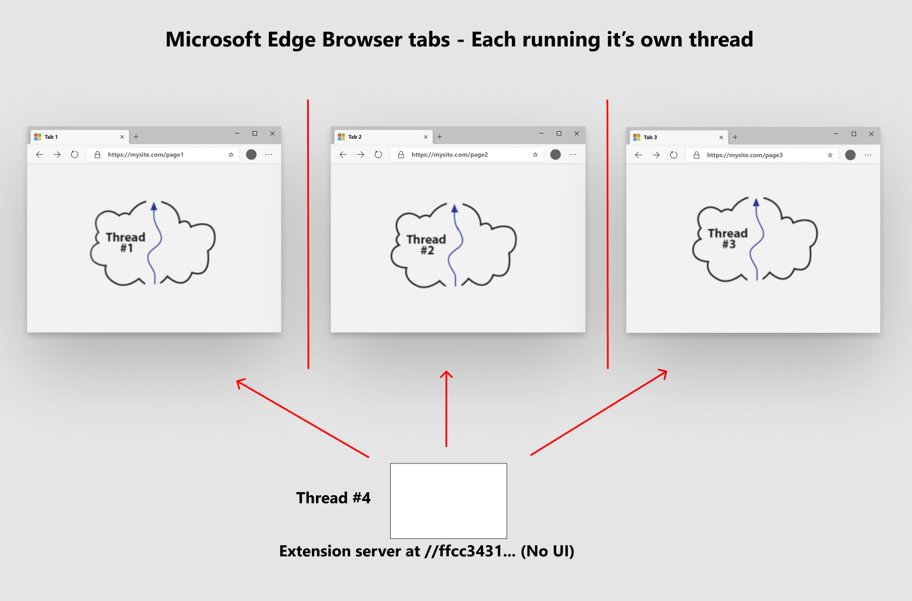

# Erweiterungskonzepte und-Architektur

Dieser Artikel enthält eine kurze Einführung in Konzepte, die beim Erstellen von Erweiterungen helfen. Um Microsoft Edge \ (Chrom \)-Erweiterungen zu verstehen, erläutern wir zunächst, wie Multi-Tab-Browser funktionieren.

## Grundlegendes zur Funktionsweise von Browsern

In der folgenden Liste werden hilfreiche Informationen erläutert, die Sie vor dem Erstellen Ihrer Erweiterung verstehen können.

1.  Jede Registerkarte des Browsers ist von jeder anderen Registerkarte isoliert.  Jede Registerkarte wird in einem eigenen Thread ausgeführt, der von anderen browserregisterkarten und-Threads isoliert ist.

      

2.  Jede Registerkarte verarbeitet eine GET-Anforderung.  Jede Registerkarte verwendet eine URL, um einen einzelnen Datenstrom abzurufen, der normalerweise ein HTML-Dokument ist.  Dieser einzelne Datenstrom oder eine Seite enthält Anweisungen wie JavaScript-Tags, Bildverweise, CSS-Verweise und vieles mehr.  Alle Ressourcen werden auf eine Registerkartenseite heruntergeladen, und die Seite wird auf der Registerkarte gerendert.  

3.  Die Kommunikation erfolgt zwischen den einzelnen Registerkarten und Remoteservern.  Jede Registerkarte wird in einer isolierten Umgebung ausgeführt. Sie sind weiterhin mit dem Internet verbunden, aber Sie sind von anderen Registerkarten isoliert.  Tabs können JavaScript ausführen, um mit Servern zu kommunizieren. Diese Server stellen den Ursprungsserver für die erste Get-Anforderung dar, die in die URL-Leiste der Registerkarte eingegeben wurde.  

4.  Das Erweiterungsmodell verwendet ein anderes Kommunikationsmodell.  Ähnlich wie Tab-Seiten werden Erweiterungen in einzelnen Threads ausgeführt, die von allen Registerkartenseiten-Threads isoliert sind.  Tabstopps Problem mit einzelnen Get-Anforderungen an Remoteserver und anschließendes Rendern der Seite. Die Erweiterungen funktionieren jedoch ähnlich wie ein Remoteserver. Wenn Sie Erweiterungen in Ihrem Browser installieren, wird im Browser ein eigenständiger Webserver erstellt. Die Erweiterung ist von allen Registerkartenseiten isoliert.  

      

## Erweiterungsarchitektur

In der folgenden Liste sind hilfreiche Informationen im Zusammenhang mit der Architektur einer Erweiterung dargestellt.  

1.  Das Extension Web Server-Paket.  Eine Erweiterung ist ein Bündel von Webressourcen. Diese Webressourcen sind mit anderen Ressourcen vergleichbar, die Webentwickler auf Web-Servern veröffentlichen. Entwickler bündeln diese Webressourcen beim Erstellen einer Erweiterung in einer ZIP-Datei.
    
    Die ZIP-Datei enthält HTML-, CSS-, JavaScript-und Bilddateien.  Im Stammverzeichnis der ZIP-Datei ist eine weitere Datei erforderlich. Diese Datei ist die Manifestdatei und hat den Namen `manifest.json` .  Es handelt sich um den Entwurf ihrer Erweiterung und umfasst die Version ihrer Erweiterung, den Titel, die Berechtigungen, die für die Ausführung der Erweiterung erforderlich sind, und so weiter.

2.  Starten des Erweiterungs Servers  Web-Server enthalten Ihr Webpaket. Browser Navigieren zu URLs auf dem Server und laden die Datei herunter, die im Browser gerendert werden soll. Browser Navigieren mithilfe von Zertifikaten, Konfigurationsdateien usw.  Wenn eine Datei vorhanden ist `index.html` , die an einem bestimmten Speicherort auf dem Webserver gespeichert ist.  

    Wenn wir Erweiterungen verwenden, wird die Registerkartenseite Ihres Browsers mit der Erweiterungs Laufzeit zum Webpaket ihrer Erweiterung.  Die Erweiterungs Laufzeit dient den Dateien aus der URL `extension://{some-long-unique-identifier}/index.html` , wobei `{some-long-unique-identifier}` ein eindeutiger Bezeichner vorhanden ist, der der Erweiterung bei der Installation zugewiesen ist.  Jede Erweiterung verwendet einen anderen eindeutigen Bezeichner. Jeder Bezeichner verweist auf das Webpaket, das in Ihrem Browser installiert ist.   

3.  Erweiterungen können mit Registerkarten und der Symbolleiste des Browsers kommunizieren.   Erweiterungen können mit der Toolbar Ihres Browsers interagieren. Jede Erweiterung verwaltet die Ausführung von Registerkartenseiten in separaten Threads, und die DOM-Manipulation auf jeder Registerkarte ist isoliert.  Erweiterungen verwenden die Erweiterungen-API, um zwischen der Erweiterung und den Registerkarten zu kommunizieren.  Diese Erweiterungs-API bietet zusätzliche Funktionen wie Benachrichtigungsverwaltung, Speicherverwaltung usw.  

    Wie bei Webservern warten Erweiterungen auf Benachrichtigungen, wenn der Browser geöffnet ist.  Erweiterungen und Registerkarten werden in Threads ausgeführt, die voneinander isoliert sind. Entwickler können jedoch die Erweiterungen-API und Berechtigungen in der Manifestdatei verwenden, um eine Erweiterung für die Arbeit mit einer Registerkartenseite zu ermöglichen.  

4. Erweiterungen bieten zum Zeitpunkt der Installation die Berechtigung zum Einwählen.  Erweiterungs Berechtigungen werden vom Entwickler in der Datei angegeben `manifest.json` . Beim Installieren von Erweiterungen werden Benutzern Informationen zu den Berechtigungen angezeigt, die von der Erweiterung ausgeführt werden müssen. Je nach Art der erforderlichen Berechtigung kann die Erweiterung Informationen aus dem Browser extrahieren und verwenden.

## Nächste Schritte

 Informationen zu den ersten Schritten mit Erweiterungen finden Sie unter [Erstellen eines Erweiterungs Lernprogramms][CreateAnExtensionPart1]. 

<!-- image links -->  

<!-- links -->  

[CreateAnExtensionPart1]: ./part1-simple-extension.md "Erstellen eines Erweiterungs Lernprogramms – Teil 1 | Microsoft docs"  